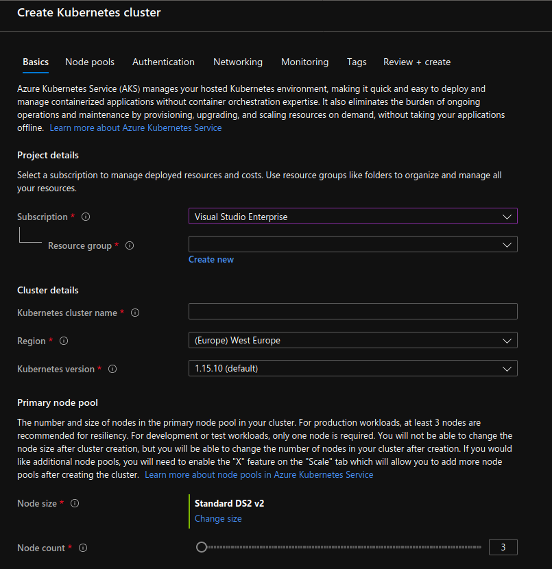

# Running Kubernetes on Azure Kubernetes Service (AKS)

Azure Kubernetes Service (AKS) is an optimized container hosting solution that works with all the
open source tools you know. Azure is great for Krustlet.

If you don't yet have a Microsoft Azure account, start a trial with $200 of free credit
[here](https://azure.microsoft.com/en-us/free/).

## Prerequisites

You should be able to run the `az` command, which is used to provision resources in the Azure cloud.

Either [install Azure
CLI](https://docs.microsoft.com/en-us/cli/azure/install-azure-cli?view=azure-cli-latest) to your
computer or [open a Cloud Shell][cloudshell] by clicking this icon near the upper right of the Azure
Portal: 

## Configure the Azure CLI

If you use [Cloud Shell][cloudshell], the `az` client command is already configured.

If you installed `az` locally, log in to your Azure account by typing `az login` at a command prompt
and complete the confirmation code process.

You can verify which account is active with the `az account show` command.

## Create an AKS Cluster

Azure can create a Kubernetes cluster using either the `az` command line or the Azure web portal.

### Option 1: Command Line

Create a group to contain the AKS cluster resources.

Export the resource group's name and location to environment variables for use by later commands:

```
$ # list worldwide datacenter locations so we can pick one
$ az account list-locations --query [].name --output tsv
$ export AZURE_DC_LOCATION=westus2  # for example
$ export AZURE_RG_NAME=myresourcegroup
$ az group create --name "${AZURE_RG_NAME}" --location "${AZURE_DC_LOCATION}"
```

Run the `az aks create` command to create your Kubernetes cluster, replacing the cluster name below
with your values:

```
$ export CLUSTER_NAME=krustlet-demo
$ az aks create --resource-group="${AZURE_RG_NAME}" --name="${CLUSTER_NAME}"
```

Azure Kubernetes Service immediately begins creating the Kubernetes cluster. After a few minutes,
the command returns with information about the new deployment:

```
DnsPrefix                          EnableRbac    Fqdn                                                             KubernetesVersion    Location    MaxAgentPools    Name           NodeResourceGroup                        ProvisioningState    ResourceGroup
------------------------------     ------------  ------------------------------------------------------------     -------------------  ----------  ---------------  -------------  ------------------------------------     -------------------  ------------------
krustlet-d-myresourcegroup-dd5bc9  True          krustlet-d-myresourcegroup-dd5bc9-a78ff054.hcp.westus.azmk8s.io  1.15.10              westus      10               krustlet-demo  MC_myresourcegroup_krustlet-demo_westus  Succeeded            myresourcegroup
```

### Option 2: Web Portal

Sign in to the Azure Portal and create a new Azure Kubernetes Service. Click on the **+ Create a
Resouce** link, then the **Compute** link, then **Kubernetes Service**.

You should be greeted with the following window:



Review and change the details to match your preferences, then click **Review + Create** in the
bottom-left of your screen.

You can monitor the progress of the deployment on the Azure dashboard, or just wait for a
notification that it has completed.

Once the cluster has booted, you'll want to connect to the cluster with `kubectl`, the Kubernetes
command line client.

If you don't already have it installed, you can install it with:

```
$ az aks install-cli
```

Connect to the cluster by running the following command:

```
$ az aks get-credentials --resource-group="${AZURE_RG_NAME}" --name="${CLUSTER_NAME}"
```

Now we can interact with our cluster! Try that out now with `kubectl cluster-info`.

To further debug and diagnose cluster problems, use `kubectl cluster-info dump`.


[cloudshell]: https://azure.microsoft.com/en-us/features/cloud-shell/
